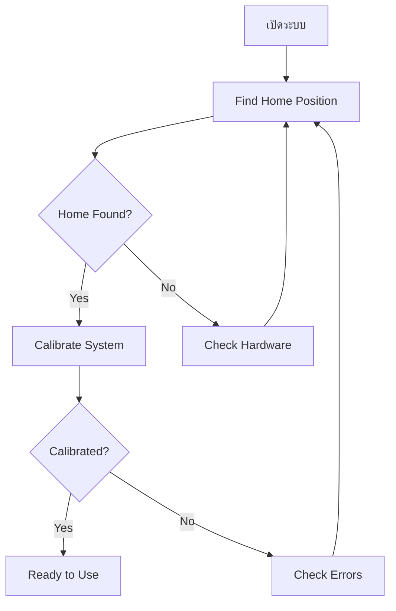
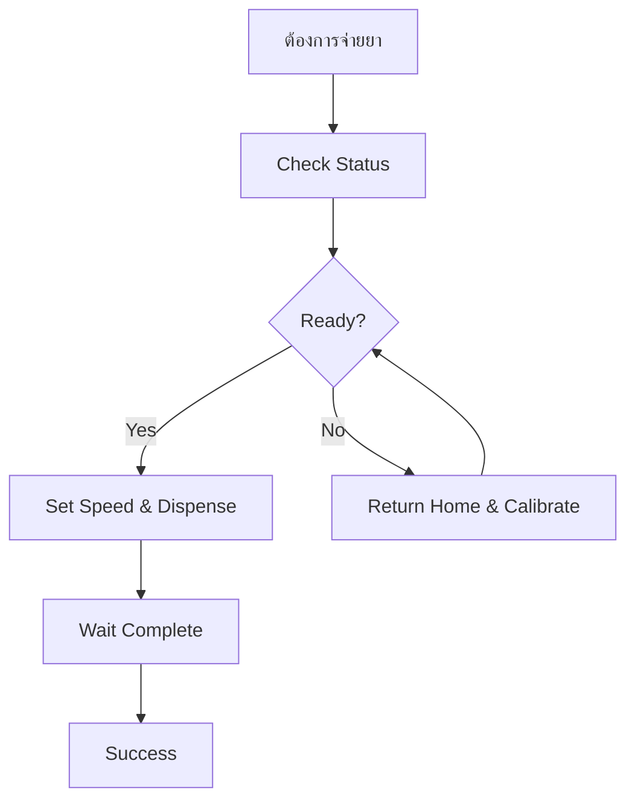

# 📡 Modbus Control with Homing - Complete Guide

## 🎯 การปรับปรุงระบบ Modbus ใหม่

### 📊 Register Map (Extended Version)

| Register | Address | Type | Description | Values |
|----------|---------|------|-------------|--------|
| **SPEED** | 10 | R/W | ความเร็วมอเตอร์ | 0-4095 |
| **DISPENSE** | 11 | R/W | จำนวนรอบที่ต้องการ | 1-99 |
| **HOME** | 12 | R/W | คำสั่ง Home | 1=Find, 2=Return |
| **CALIBRATE** | 13 | R/W | คำสั่ง Calibration | 1=Start |
| **STATUS** | 20 | R | สถานะระบบ | Bit flags |
| **POSITION** | 21 | R | ตำแหน่งปัจจุบัน | x100 (precision) |
| **ERROR** | 22 | R | รหัสข้อผิดพลาด | Error codes |

### 🔧 Command Codes

#### Home Commands (Register 12)
- `0` = No command
- `1` = Find home position
- `2` = Return to home

#### Calibration Commands (Register 13)
- `0` = No command
- `1` = Start full calibration

### 📊 Status Bits (Register 20)

| Bit | Description |
|-----|-------------|
| 0 | Motor Running |
| 1 | Dispense Active |
| 2 | Home Found |
| 3 | System Calibrated |
| 4 | At Home Position |
| 5 | Homing in Progress |
| 6 | Calibrating |
| 7 | Error Condition |

### ⚠️ Error Codes (Register 22)

| Code | Description |
|------|-------------|
| 0 | No error |
| 1 | Home not found |
| 2 | System not calibrated |
| 3 | Invalid command |
| 4 | Motor timeout |

## 🚀 วิธีการใช้งาน

### 1. **ขั้นตอนเริ่มต้นระบบ (แนะนำ)**

```
Step 1: Find Home Position
- Write Register 12 = 1
- Wait until bit 5 (Homing) = 0
- Check bit 2 (Home Found) = 1

Step 2: Calibrate System  
- Write Register 13 = 1
- Wait until bit 6 (Calibrating) = 0
- Check bit 3 (Calibrated) = 1

Step 3: Ready to use!
```

### 2. **การจ่ายยาปกติ**

```
1. เช็คสถานะก่อน:
   - Read Register 20
   - ต้องมี: bit 2 (Home Found) = 1
   - ต้องมี: bit 3 (Calibrated) = 1

2. สั่งจ่ายยา:
   - Write Register 10 = speed (เช่น 3000)
   - Write Register 11 = rotations (เช่น 5)

3. รอให้เสร็จ:
   - Read Register 20 ซ้ำๆ
   - รอจนกว่า bit 1 (Dispense Active) = 0
```

### 3. **การกลับ Home**

```
1. Write Register 12 = 2 (Return Home)
2. รอจนกว่า bit 4 (At Home) = 1
```

## 💻 ตัวอย่าง Python Code (Simple)

```python
from pymodbus.client.sync import ModbusSerialClient

client = ModbusSerialClient(method='rtu', port='COM3', baudrate=9600)
client.connect()

def check_status():
    """ตรวจสอบสถานะ"""
    status = client.read_holding_registers(20, 3, unit=55)
    status_bits = status.registers[0]
    position = status.registers[1] / 100.0
    error = status.registers[2]
    
    print(f"Status: 0x{status_bits:02X}")
    print(f"Position: {position:.2f}")
    print(f"Error: {error}")
    print(f"Home Found: {bool(status_bits & 0x04)}")
    print(f"Calibrated: {bool(status_bits & 0x08)}")

def find_home():
    """หา Home Position"""
    print("Finding home...")
    client.write_register(12, 1, unit=55)  # Find home
    
    while True:
        status = client.read_holding_registers(20, 1, unit=55)
        if not (status.registers[0] & 0x20):  # ไม่ได้ homing แล้ว
            break
        time.sleep(1)
    
    print("Home finding completed")

def calibrate():
    """Calibration"""
    print("Calibrating...")
    client.write_register(13, 1, unit=55)  # Start calibration
    
    while True:
        status = client.read_holding_registers(20, 1, unit=55)
        if not (status.registers[0] & 0x40):  # ไม่ได้ calibrating แล้ว
            break
        time.sleep(2)
    
    print("Calibration completed")

def dispense(rotations, speed=3000):
    """จ่ายยา"""
    print(f"Dispensing {rotations} rotations...")
    client.write_register(10, speed, unit=55)      # Set speed
    client.write_register(11, rotations, unit=55)  # Start dispense
    
    while True:
        status = client.read_holding_registers(20, 1, unit=55)
        if not (status.registers[0] & 0x02):  # ไม่ได้ dispensing แล้ว
            break
        time.sleep(1)
    
    print("Dispensing completed")

# ตัวอย่างการใช้งาน
check_status()
find_home()
calibrate()
dispense(3, 2500)
```

## 🔍 Workflow แนะนำ

### ขั้นตอนเริ่มต้นระบบ (ทำครั้งเดียว)



### ขั้นตอนการใช้งานปกติ



## 🛠️ การแก้ไขปัญหา

| ปัญหา | Error Code | วิธีแก้ |
|-------|------------|---------|
| ไม่พบ Home | 1 | ตรวจสอบเซ็นเซอร์ SEN_2 |
| ไม่ได้ Calibrate | 2 | รัน Calibration ใหม่ |
| คำสั่งผิด | 3 | ตรวจสอบค่าที่ส่ง |
| Motor Timeout | 4 | ตรวจสอบกล |

## 📝 Tips การใช้งาน

### ✅ Do's
- ✅ **ทำ Home + Calibration ก่อนเสมอ**
- ✅ **ตรวจสอบ Status ก่อนสั่งงาน**  
- ✅ **ใช้ timeout ในการรอ**
- ✅ **เช็ค Error Code เป็นประจำ**

### ❌ Don'ts  
- ❌ **อย่าสั่งงานซ้อนกัน**
- ❌ **อย่าข้าม Calibration**
- ❌ **อย่าใช้ความเร็วสูงเกินไป**
- ❌ **อย่าปล่อยให้ Error ค้าง**

## 🎯 ข้อดีของระบบใหม่

✅ **ครบครัน** - ควบคุมทุกอย่างผ่าน Modbus  
✅ **ปลอดภัย** - ต้อง Home + Calibrate ก่อน  
✅ **แม่นยำ** - มี Position feedback  
✅ **เสถียร** - มี Error handling  
✅ **ยืดหยุ่น** - ปรับแต่งได้ง่าย  

---
*ระบบพร้อมใช้งาน! 🚀*